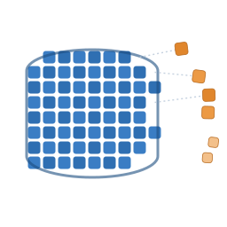

<p align="center">
  <picture>
    <source media="(prefers-color-scheme: dark)" srcset="docs/logo/mark-dark.svg">
    
  </picture>
</p>

<h1 align="center">sqlite3-legacy-amalgamation</h1>
<p align="center"><em>SQLite's single-file amalgamation, mechanically taken apart — one struct, function, or typedef per file.</em></p>

## What this is

SQLite is normally consumed as one giant generated file, `sqlite3.c` (the
"amalgamation") — recommended by upstream because a single translation unit
lets the compiler optimize across the whole library. This project starts
from that same 3.53.4 amalgamation and does the opposite: it pulls every
symbol back out into its own `.c`/`.h` pair under [`src/sqlite/`](src/sqlite/),
while keeping the result building as a single library the whole time.

It exists as groundwork for converting the codebase to modern C++: a
flat, one-symbol-per-file tree is much easier to reorganize, namespace, and
convert piece by piece than a 230,000-line single file. See
[docs/architecture.md](docs/architecture.md) for how the decomposition works
and what's already been applied.

## Status

- **Decomposition**: 262 `.c` files / 322 `.h` files under `src/sqlite/`,
  one symbol per pair. Per-translation-unit includes are precise (no
  blanket `_All.h`); leaked cross-file helpers have been sorted into
  `static`-where-possible or properly declared (no more catch-all
  `_Uncategorized.h` — see [`uncategorized-report.json`](tools/clang-refactor/uncategorized-report.json)
  for the historical record of that pass).
- **Build**: a single CMake target compiles the whole tree as C23 into
  `libsqlite3-legacy-amalgamation.so`.
- **Next**: [`docs/Specifications/srs-002.md`](docs/Specifications/srs-002.md)
  calls for converting every iterable construct in the library to a
  consistent iterator pattern (example scaffolding in
  [`iterable-pattern-example/`](docs/Specifications/srs-002.md.d/iterable-pattern-example/)).
  Not yet applied to `src/sqlite/`.

## Building

Requires CMake ≥ 3.24 and a C23-capable compiler (recent GCC or Clang).

```sh
cmake -S . -B build
cmake --build build
```

This produces `build/libsqlite3-legacy-amalgamation.so`, linked against
`Threads` and `libm`.

## Source tree

```
src/sqlite/         one .c/.h pair per struct, function, or typedef
src/sqlite/utils/    platform-specific subtrees (posix/, unix/)
tools/clang-refactor/  libclang- and clang-tidy-based scripts that perform
                       the mechanical refactors this tree has gone through
docs/                architecture notes, SRS specifications, logo
```

## Tooling

The decomposition and cleanup passes aren't hand-edited — they're applied
with standalone `libclang`/`clang-tidy`-based scripts in
[`tools/clang-refactor/`](tools/clang-refactor/), each doing one narrow,
re-runnable transformation (splitting a struct into its own header,
computing precise per-file includes, forward-declaring struct-pointer
members, enforcing naming conventions, and so on). See
[docs/architecture.md](docs/architecture.md#the-refactor-toolchain) for what
each one does.

## Relationship to the parent `sqlite-cpp` workspace

This directory sits inside a larger `sqlite-cpp` workspace that runs its
own, differently-shaped refactor of SQLite (split by subsystem into
`libsqlite-utils`, `libsqlite-backend-*`, `libsqlite-core-*`,
`libsqlite-compiler-*`, advancing through a four-stage SRS pipeline). This
project is a separate, independent decomposition — down to one file per
symbol across the whole amalgamation rather than one library per subsystem
— with its own git history and its own local `srs-001`/`srs-002` documents
under [`docs/Specifications/`](docs/Specifications/). See
[docs/index.md](docs/index.md#relationship-to-the-parent-workspace) for
more detail.

## Documentation

- [docs/index.md](docs/index.md) — documentation hub
- [docs/architecture.md](docs/architecture.md) — container convention, refactor toolchain, build
- [docs/Specifications/](docs/Specifications/) — SRS documents
- [docs/logo/](docs/logo/) — the mark, its rationale, and usage

## License

SQLite itself is in the [public domain](https://sqlite.org/copyright.html).
This repository does not yet carry its own `LICENSE` file for the
refactoring work layered on top.
